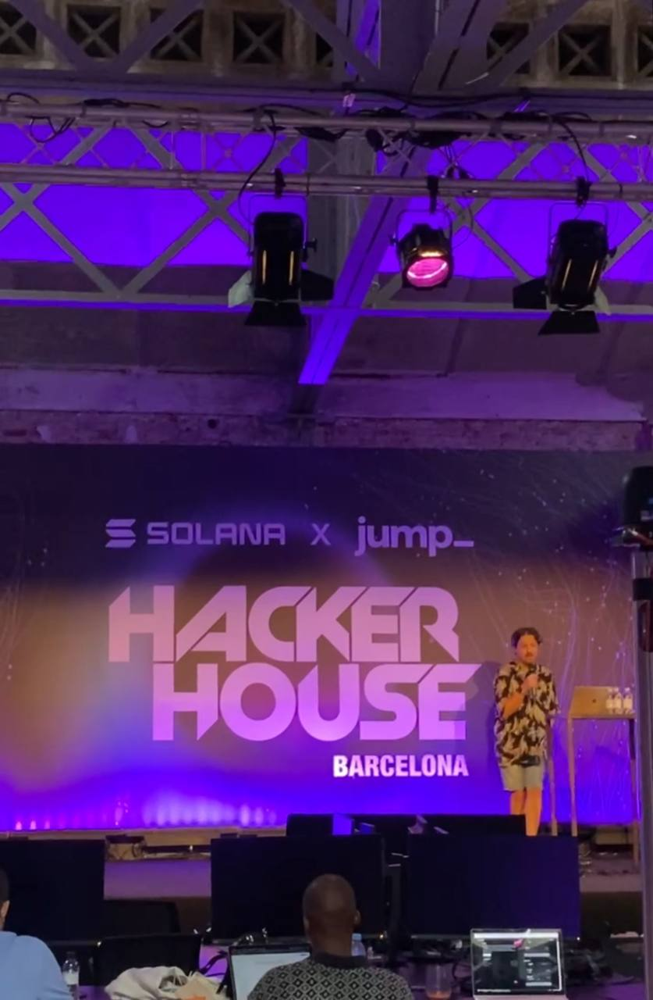
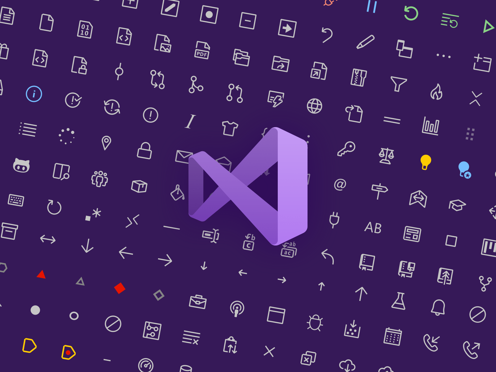

# Un CV en<span style="color:#ED6D3C;"> 1000 lineas</span> de código abierto

#####  <span style="color:#FFFCF2;">Por</span><span style="color:#ED6D3C;"> Miguel gargallo</span>

---


# Con la colaboración de <span style="color:#ED6D3C;">Especialisterne</span> y<span style="color:#ED6D3C;"> Fundación Esplai</span>

---

## Proceso de <span style="color:#ED6D3C;">Creación</span> y <span style="color:#ED6D3C;">Desarrollo</span>

| Tipo | Descripción | Valoración | Tiempo | Lineas |
| --- | --- | --- | --- | --- |
| <span style="color:#EB5E28;">HTML</span> |Principal | Importante | 20 mins | 280 |
| <span style="color:#74acfc;">CSS</span>  |  Estilos | Regular | 10 mins | 280 |
| <span style="color:#ff0f;">JS</span>  | Script | Importante | 45 mins | 330 |
| <span style="color:#CCC5B9;">JSON</span>  | Datos |  Importante | 30 mins | 200 |
| Total |  |  | 150 mins | 1090 |

---

# Tecnologías y Herramientas

---


---


---


---




---

## Desafíos y Dificultades

- Revisar archivos <span style="color:#ED6D3C;">duplicados</span> y<span style="color:#ED6D3C;"> no utilizados</span> .

---

# DEMO

---

## Futuras Direcciones

- La web podría evolucionar a React o Astro 2.2.3.
- Se busca la reactividad.

---

## Conclusión

- Refrescar conocimientos de <span style="color:#EB5E28;"> HTML</span> y <span style="color:#74acfc;">CSS</span> y <span style="color:#ff0f;">JS</span>.
- <span style="color:#CCC5B9;">JS</span>Estructurar el código por archivos.


---

### Disponible Gratis Ya en GitHub
##### <span style="color:#FFFCF2;">https://</span><span style="color:#ED6D3C;">github.com/miguelgargallo/cv</span>

---

# Lineas de futuro

---

# <span style="color:#ED6D3C;">AS</span><span style="color:#252422;">T</span></span><span style="color:#ED6D3C;">RO</span>


---

```html
<h1>Miguel Gargallo<h1>

    <a 
        href="mailto:hello@miguelgargallo.com"
        target="_blank"
        >
        hello@miguelgargallo.com 
    </a>
    
    <a 
        href="https://twitter.com/miguelgargallo"
        target="_blank">
        Mi Twitter, @miguelgargallo 
    </a>
```