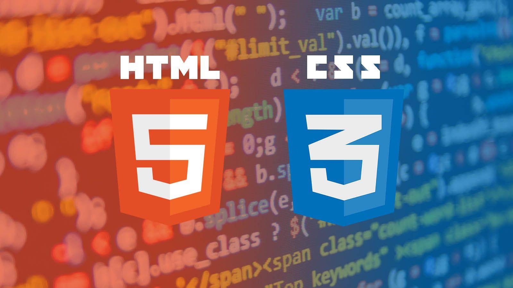

# Un CV en<span style="color:#ED6D3C;"> 1000 líneas</span> de código abierto

#####  <span style="color:#FFFCF2;">Por</span><span style="color:#ED6D3C;"> @miguelgargallo</span>

---


# Con la colaboración de <span style="color:#ED6D3C;">Specialisterne</span> y<span style="color:#ED6D3C;"> Fundación Esplai</span>

---


# DEMO

---

# Tecnologías y Herramientas

---


---



---


---


---

## Desafíos y Dificultades

- Revisar archivos <span style="color:#ED6D3C;">duplicados</span> y<span style="color:#ED6D3C;"> no utilizados</span> .

---

# Líneas de código

<span style="color:#EB5E28;">HTML</span> 280
<span style="color:#74acfc;">CSS</span> 280
<span style="color:#ff0f;">JS</span> 330
<span style="color:#CCC5B9;">JSON</span> 200
<span style="color:#ED6D3C;">--------------</span>
Total 1090

---

## Proceso de <span style="color:#ED6D3C;">Desarrollo</span>

| Tarea | Estimación | |  | Realidad |  |
| --- | --- | --- | --- | --- | --- |
| Tipo | Prioridad | Tiempo | Prioridad | Tiempo |
| <span style="color:#EB5E28;">HTML</span> | V | 45 | I | 45 + 30 |
| <span style="color:#74acfc;">CSS</span>  | N | 45 | N | 30 |
| <span style="color:#ff0f;">JS</span> | I | 45  | V | 45 +  30 |
| <span style="color:#CCC5B9;">JSON</span>  | V | 45 | I | 15 |
| Total | | 180 |  | 165 |

---


### Gráfico de <span style="color:#ED6D3C;"> desarrollo</span>

```md
|    Tiempo Estimado (unidades)
|      300 +-----------------+
|          |                 |
|          |                 |
|          |         JS      |
|          |        ●        |
|  200 +---+      .   .      |
|          |    .       .    |
|          |  .           .  |
|          |.               .|
|  100 +---+ HTML   ●  CSS   |
|          |       .         |
|          |     .           |
|          |   .             |
|          | .               |
|    0 +---+-----------------+
|          JSON
|          ●
|
+----------------------------
      Actual Time (units)

```

---

```md
         Estimado          Actual
            Tiempo (unidades)
   350 +------------------------+
       |                        |
   300 +---+                    |
       |   |                    |
   250 +---+---+                |
       |   |   |                |
   200 +---+---+---+            |
       |   |   |   |            |
   150 +---+---+---+---+        |
       |   |   |   |   |        |
   100 +---+---+---+---+---+    |
       |   |   |   |   |   |    |
    50 +---+---+---+---+---+---+
       | HTML  CSS   JS  JSON  |
     0 +------------------------+
```

---

# Líneas de futuro

Astro: Se busca una evolución de html a Astro ya que es un framework que permite la reactividad y la carga de componentes.

<span style="color:#ED6D3C;">https://miguelgargallo.com/</span>


---

## Conclusión

- Refrescar conocimientos de <span style="color:#EB5E28;"> HTML</span> y <span style="color:#74acfc;">CSS</span> y <span style="color:#ff0f;">JS</span>.
- Estructurar el código por archivos.


---


### Disponible Gratis Ya en GitHub
##### <span style="color:#FFFCF2;">https://</span><span style="color:#ED6D3C;">github.com/miguelgargallo/cv</span>

---

```html
<h1>Miguel Gargallo<h1>

    <a 
        href="mailto:hello@miguelgargallo.com"
        target="_blank"
        >
        hello@miguelgargallo.com 
    </a>
    
    <a 
        href="https://twitter.com/miguelgargallo"
        target="_blank">
        Mi Twitter, @miguelgargallo 
    </a>
```